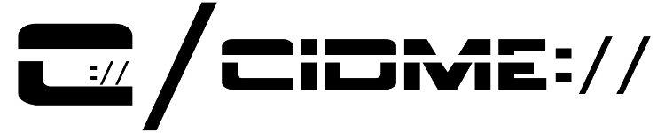
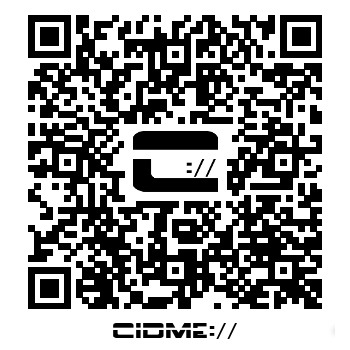

CIDME GitHub repository CIDME ID/URL: _cidme://public/EntityContext/f35b23ca-27a9-4724-b047-e8a5c7267db1_

# CIDME (_Pronounced SID-MEE_)
Giving an identity to, and storing information about people, organizations, places, and things.   Your knowledge, _connected_.

📌⛔⚠ **_IMPORTANT NOTE:_ This project is in it's very early stages.  Therefore anything in this document may change at any time, and any information in this document may also be incorrect or outdated at any point!!!**

## Table of Contents
* [What is CIDME???](#whatisit)
* [What are contexts?](#contexts)
* [What does CIDME _not_ do?](#notdo)
* [So what _does_ CIDME do?](#whatitdo)
* [Project Goals / Guidelines](#goals)
* [Why use CIDME?](#whyuse)
* [Why not just use IdM/IaM?](#whynotidm)
* [Why the name *CIDME*?](#whythename)
* [Current project status](#status)
* [Documentation](#docs)
* [Basic CIDME Architecture](#architecture)
  * [Entity Relationship Diagram (*ERD*)](#erd)
* [Other projects making use of *CIDME*](#otherprojects)
* [Who is "*we*"?](#whoiswe)
* [Who is *Joe Thielen*?](#joethielen)

## What is CIDME???
CIDME is software to help manage contextualized contact/identity information and is meant to be integrated/embedded/used by other software projects/applications.  At it's most basic level, it could be considered a contact manager... _on steroids_!  But it's much more than that.  There is a lot of software out there that can manage contact/identity information.  CIDME is different in that it brings another concept into play... putting this information into _contexts_.

While heavy emphasis is placed on _contexts_ in CIDME, it's entirely possible to use it as a simple contact manager as well.  

Before we discuss what exactly CIDME does, let's first go over what _contexts_ are, and what CIDME does _not_ do...

[*Back to TOC*](#toc)

## What are contexts?
In the health care world a context could be an _episode of care_ or even an individual _encounter_ for a given patient.  In _case management_, the individual _cases_ themselves could be contexts.  Complex cases may actually need to be dealt with in parts, each of which could also be considered a context.  

To put it another way, let's consider the fictional character of [Dr. Jekyll / Mr. Hyde](https://en.wikipedia.org/wiki/Dr._Jekyll_and_Mr._Hyde_(character)).  Technically, this is one person.  One _entity_.  But you could consider him to have two separate _identities_... one as _Dr. Jekyll_ and the other as _Mr. Hyde_.  Therefore, it can be said that this single entity can be referred to in two different contexts.  If you're referring to Dr. Jekyll that's one contextual identity.  Likewise if you're referring to Mr. Hyde, that's a second contextual identity.  You may wish to collect and/or associate different sets of information with these different identities.  In a typical identity management scenario it's not possible to separate this information.   It all goes in under one person, making for a confusing experience when trying to reference certain pieces of information related to just one of the identities.  In CIDME, one entity can be created to reference the person/entity known by both names, but yet have two contexts by which to refer separately to Dr. Jekyll and Mr. Hyde.

Let's get back to real life here.  Whether your needs are based on separating information by _episodes of care_, _encounters_, _cases_, or _whatever_, CIDME can provide a better way to help deal with, and separate, this information.

CIDME contexts can also be _nested_, meaning a given context can be a _subcontext_ of another.  Again, using the health care world as an example, the top level context could be for _episode of care_ and individual _encounters_ could be linked to that as subcontexts.

CIDME also provides the ability to associate date ranges with contexts.  Why is this useful?  **DATA RETENTION** and **DATA PURGING**.  Most software applications deal with getting information _into_ the system.  Very few provide methods of getting rid of it, especially on a timely basis and in an easy manner.  Let's say you're required to keep information for a given person for _X_ number of years.  CIDME specifically provides for date ranges to make this possible!

[*Back to TOC*](#toc)

## What does CIDME _not_ do?
CIDME does not provide for access control / authorization (_but it certainly could be incorporated into one, especially a custom one_).  There are already many software projects/solutions that deal with this.  Therefore, CIDME doesn't necessarily fall into these following categories:
* **Identity Management (__IdM__)**
* **Identity and Access Management (_IaM_)**
* **Access and identity management" (_AIM_)**

CIDME is not, nor does it use, _LDAP_.  However CIDME does provide a lot of similar functionality as LDAP / _directory services_.

CIDME is not a stand-alone piece of software!  It can not be used by itself.

[*Back to TOC*](#toc)

## So what _does_ CIDME do?

CIDME provides functionality to:
* Store and retrieve entity and identity information.
  * This includes such personal information such as:
    * Personally Identifiable Information (PII)
      * Name
      * Demographics
    * Contact information:
      * Postal addresses
      * Phone Numbers
      * Email addresses
    * etc...
  * This can also include keeping a history of the above information, to keep track of changes.
* Associate the above information with specific contexts for a given entity.
* **MORE TO COME...**

[*Back to TOC*](#toc)

## Project Goals / Guidelines

* CIDME is intended to be integrated, embedded, and/or used by other software projects / applications.  
  * CIDME is NOT a stand-alone piece of software!

[*Back to TOC*](#toc)

## Why use CIDME?

Good question!

* Keeping Personally Identifying Information (PII) separate from other parts of a system is good practice.
  * CIDME is intended to be hidden from public access and not directly available except through application logic.
  * CIDME provides random, unique, identifiers for identities / contexts.  These can be used and stored by the application instead of the actual PII.  
    * When the actual PII needs to be referenced, the application uses CIDME to retrieve it.
* Keeping PII as well as Protected Health Information (PHI) separate is important, where applicable.
* Contexts!!!
* Quick start your new application by not re-inventing the wheel.

[*Back to TOC*](#toc)

## Why not just use IdM/IaM?

Another good question!

CIDME is not an IdM/IaM replacement.  You probably want to use IdM/IaM in addition to CIDME.  IdM/IaM help control access to your _application users_.  While information about them can also go into CIDME, it's the information about _other people_ for which CIDME is intended.  For example, in the health care world, the hospital or clinic has an information system (_EHR_) which isn't typically intended to be accessed by the patient.  But it _is_ designed to store information _about_ the patient.  The nurses and doctors are typically the _users_ in this situation, and those would be covered by IdM/IaM.  But the patient, in this situation, is better covered by separate functionality.  

This is where CIDME comes into play.

[*Back to TOC*](#toc)

## Why the name *CIDME*?

After putting a considerable amount of thought into what this project was to be, as well as what it was not, the CIDME acronym was chosen as it's contents best accurately describes what the project provides.  An _engine_ to _manage contextualized identity_ information.  

The only other major usage of the term which turns up during web searches is a Dental clinic in Spain.  I figured the acronym was unique enough to use and build upon for a software project.

[*Back to TOC*](#toc)

## Current project status

* The project was first created in October 2016.
* As of Jan 2018 the project focus is creating the core engine.
* There is currently no useful software produced by this project, _yet_.

[*Back to TOC*](#toc)

## Documentation

Aside from this document, please refer to the [project wiki](../../wiki/)!

[*Back to TOC*](#toc)

## Basic CIDME Architecture

The current focus is implementing the core functionality into an easily embedded package.

[*Back to TOC*](#toc)

### Entity Relationship Diagram (*ERD*)

**NOTE - This is a DRAFT and may change at any time!**

[Click here to view the entire diagram/file](/docs/CIDME-Entity_Rel_Diagram-DRAFT.png)

[*Back to TOC*](#toc)

## Other projects making use of CIDME

* [IMSFAY](http://www.github.com/IMSFAY/IMSFAY) - *Information Management System for Families, Adults, and Youth*
  * Uses a prototype version created with PHP and the Neo4j graphing database.

[*Back to TOC*](#toc)

## Who is behind CIDME?

Well, um, currently, it's just me, Joe Thielen, project creator.  But I'm hoping in time the project will grow and be joined by other individuals who share similar beliefs in the project goals / guidelines.

Please, *feel free* to drop me a line!  I've created this project on GitHub specifically to help attract attention and make the project larger than myself.

[*Back to TOC*](#toc)

## Who is *Joe Thielen*?

I've been creating fairly complex, but monolithic, LAMP apps for both non- and for-profit companies for over 20 years.  My experience lies with small- and medium- sized organizations / businesses in the USA.  Most of these apps have, in one form or another, made heavy use of, or even dealt primarily with, contact / identity information.  The genesis of this project was to create a separate piece of software to provide this functionality, so as to be able to be used by other software projects.

View my [LinkedIn Profile](https://www.linkedin.com/in/joethielen) for more professional (*or lack thereof*) information.

[*Back to TOC*](#toc)
